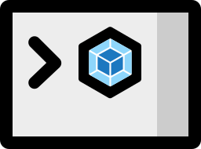

[tests]: 	https://img.shields.io/circleci/project/github/shellscape/webpack-nano.svg
[tests-url]: https://circleci.com/gh/shellscape/webpack-nano

[cover]: https://codecov.io/gh/shellscape/webpack-nano/branch/master/graph/badge.svg
[cover-url]: https://codecov.io/gh/shellscape/webpack-nano

[size]: https://packagephobia.now.sh/badge?p=webpack-nano
[size-url]: https://packagephobia.now.sh/result?p=webpack-nano

<div align="center">
	<br/><br/>
</div>

# webpack-nano [![tests][tests]][tests-url] [![cover][cover]][cover-url] [![size][size]][size-url]

A teensy, squeaky 🐤 clean Webpack CLI

`webpack-nano` operates on the premise that all options for configuring a webpack build are set via a [config file](https://webpack.js.org/configuration/).

## Install

Using npm:

```console
npm install webpack-nano --save-dev
```

<a href="https://www.patreon.com/shellscape">
  
</a>

## Requirements

`webpack-nano` is an evergreen module. 🌲 This module requires Node v10.11.0+.

## Benefits

- Holy bananas 🍌 it's itsy bitsy
- Doesn't hit you over the head with an avalanche of flags and options
- It does one thing: tells webpack to start a build
- And can tell webpack to [watch for changes](https://webpack.js.org/configuration/watch/) in build files (So that's two things)
- ~90% smaller than webpack-cli and webpack-command

## Usage

```console
$ npx wp --help

  Usage
    $ wp [...options]

  Options
    --config          A path to a webpack config file
    --config.{name}   A path to a webpack config file, and the config name to run
    --help            Displays this message
    --silent          Instruct the CLI to produce no console output
    --version         Displays webpack-nano and webpack versions

  Examples
    $ wp
    $ wp --help
    $ wp --config webpack.config.js
    $ wp --config.serve webpack.config.js
```
